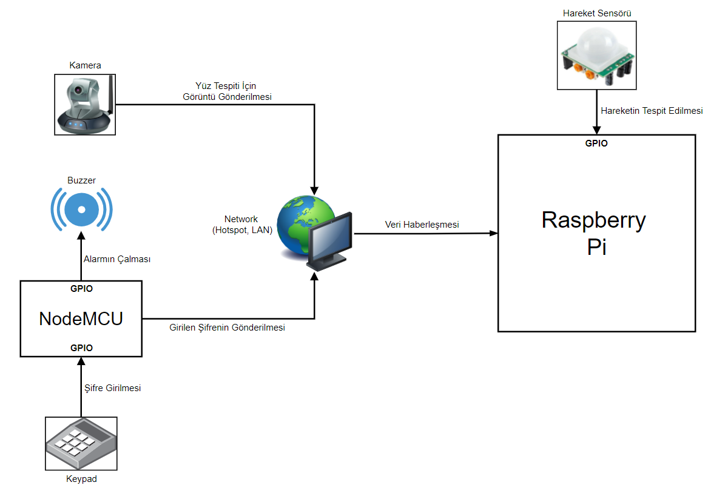
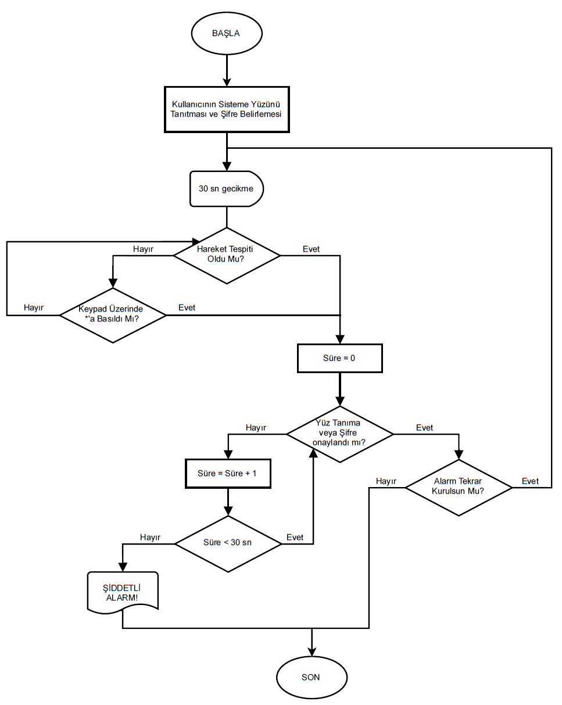

# Raspberry Pi ile Alarm Sistemi

Günümüzde güvenlik sistemleri ev ve binaların güvenliği için önem arz etmektedir. Binanın içinde tanımadık biri (hırsız) binanızdaki eşyaları çalabilir. Genellikle hırsızlar binaya giren ev sahiplerinin yanında diğer ev sahiplerinin tanıdığıymış gibi girerek binada bulunan ortak eşyaları ayakkabıları, bisikletleri çalabilmektedir. Ayrıca şüpheli davranışları tespit etmek için günümüzde sabit kameralar kullanılmaktadır ve bu da tam olarak bir gözetim sağlamak için birden çok kameranın farklı noktaları görmesi gerektiği anlamına gelir.

Projede kamera gibi pahalı bir aygıtı birçok yere yerleştirmek çok büyük maliyetler gerektirdiğinden daha düşük bütçeli bir yaklaşımın var olabileceğinin fizibilitesi yapıldı. Fizibilite sonucunda PIR (hareket sensörü) gibi ultrasonik (infrared) dalgaları kullanan sensörlerin kameralara göre çok daha ucuz bir maliyetle alınabileceği tespit edildi. Bir gömülü sistem tasarımında en önemli kriterlerden biri kuşkusuz sistemin ucuz bir şekilde elde edilebilmesidir. Bu projede de buna dikkat edilerek en ucuz olacak şekilde efektif bir proje geliştirilmiştir.
Proje kapsamında gömülü sistemde kullanılan elemanlar aşağıdaki gibidir:
- Raspberry Pi
- Kamera
- PIR (Hareket Sensörü)
- Keypad
- Buzzer (Alarm sesi için)
- NodeMCU
- Çeşitli Led’ler

Projede geliştirilen gömülü sistemin akışı kısaca aşağıdaki gibidir:
1. Kullanıcının yüzü sisteme tanıtılacak, ayrıca keypad ile de girilebilmesi için bir şifre belirlenecek.
2. Sistem kurulduktan sonra ev içinde bulunan hareket sensörü ile hareket tespit edildiğinde kullanıcıdan şifre girmesi veya yüzünü göstermesi beklenecektir.
3. Kullanıcı evdeyse kameraya yüzünü göstererek (Yüz Tanıma) ya da keypad ile daha önceden belirlediği şifreyi girerek hareketi yapanın kendisi olduğunu sisteme bildirebilecek. Böylece alarm şiddetlenmeden susturulacak.
4. Eğer hareketi yapan kişi belli bir süre içinde yukarıdakilerden birini yapmazsa ev içinde alarm şiddetli bir şekilde çalmaya başlayacak. (Evde tanınmayan biri var uyarısı!)
Geliştirilen alarm sistemi evde kurulmadan önce yapılması gereken işlemler şunlar olacaktır:
   - Kullanıcının Yüzünün Sisteme Tanıtılması: Bu işlem için yüz tanıma algoritması ile kullanıcının yüzüne veya eklemek istediği diğer yüzlere (ev içindeki diğer kişiler vs.) ait encoding’ler bulunup sistemin veritabanında saklanacaktır. Sistem devreye girdikten sonra veritabanındaki yüzlere ait encoding’ler canlı olarak gelen encoding ile karşılaştırılıp kullanıcının yüzü tespit edilerek onaylanacaktır.
   - Şifre Belirlenmesi: Sistemi kullanan kişi yüz tanıma dışında şifre ile tanıtma işlemi yapmayı tercih edebilecektir. Bu kapsamda kullanıcının alarm sistemini kurmadan önce yine bir şifre belirlemesi gerekecektir. Daha sonra hareket tespit edildiğinde kullanıcı şifre ile de hareketi yapanın kendisi olduğunu sisteme onaylatabilecektir.

Yukarıdaki iki işlem de kullanıcı tarafından gerçekleştirildikten sonra alarm sistemi artık kurulabilecektir.

Projenin genel blok diyagramı:

Projenin genel akış diyagramı:

*Bu proje Yıldız Teknik Üniversitesi - Bilgisayar Mühendisliği, Gömülü Sistemler dersi kapsamında yapılmıştır.
